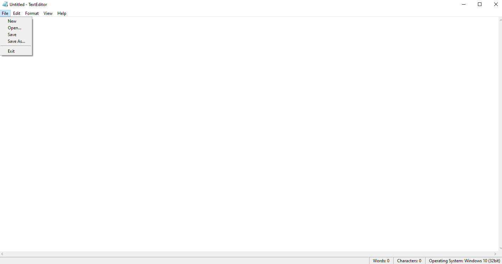
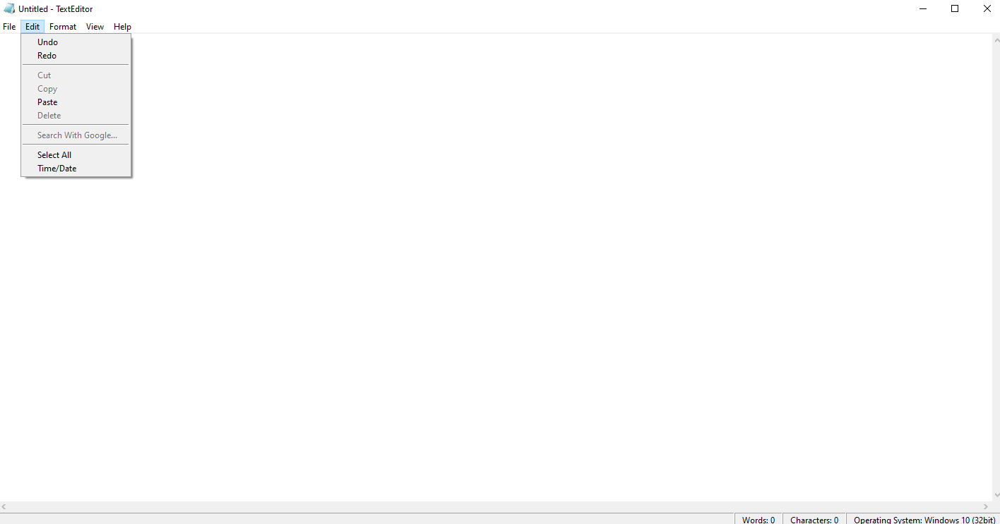
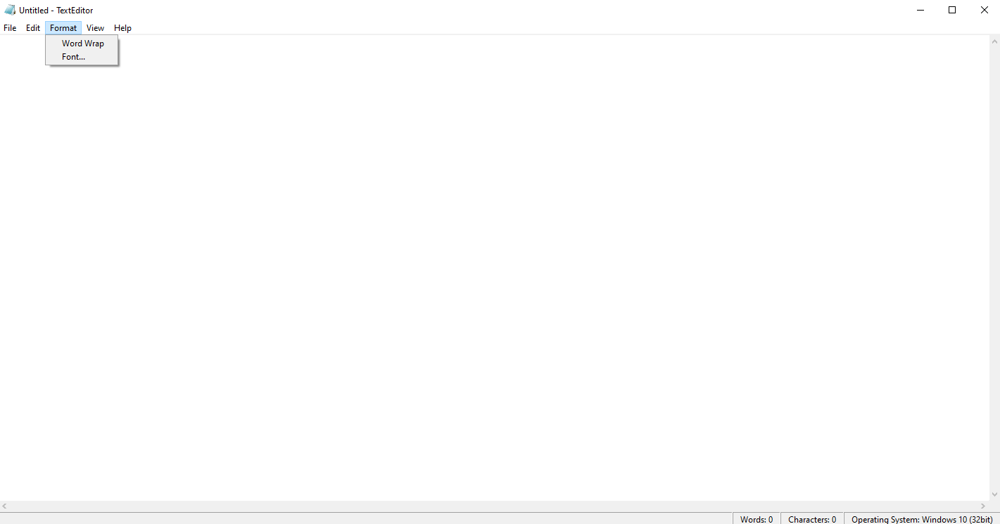
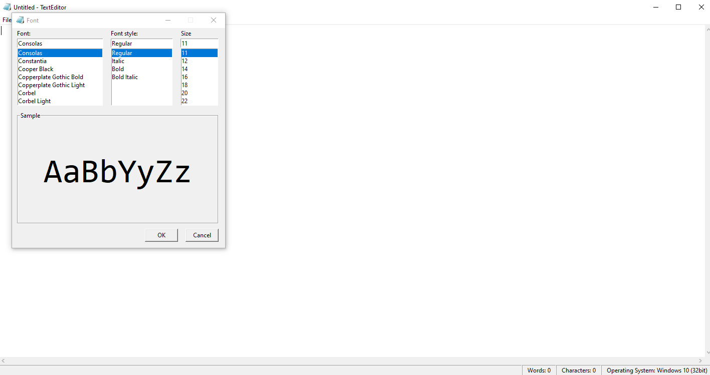
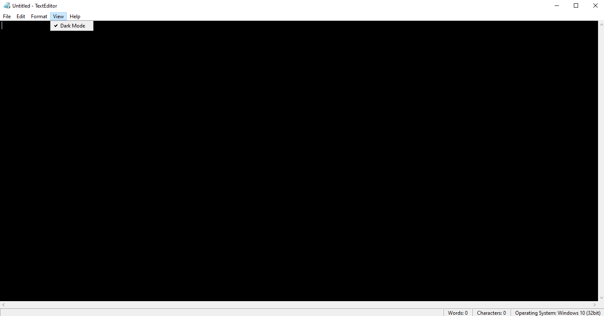
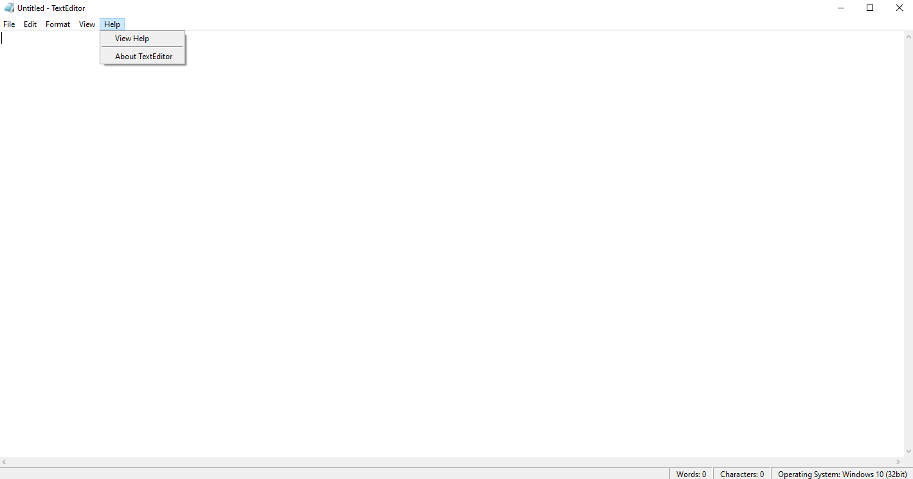

# TextEditor
A text editor app built with Python 3, Tkinter GUI and SQLite3 database to remember your preferences. Currently this text editor only works with .txt files.

# Features
The app is very simple and is capable of creating and saving new .txt files, and opening, editing and saving exiting .txt files.

The app allows for undoing and redoing actions, cutting, copying, deleting and performing a Google search on selected text, pasting whatever is currently in the clipboard to the text area, selecting everything in the text area, and inserting the current date and time in to the text area.

The app allows for toggling word wrap on and off, 

as well as changing the font, font style and font size.

The app can have its default look changed to Dark Mode.

The app also offers a help menu.

# Running the program
To run the program simply download all the files from this repository:

Extract the files:

Run the main_app.py file from the command line:

