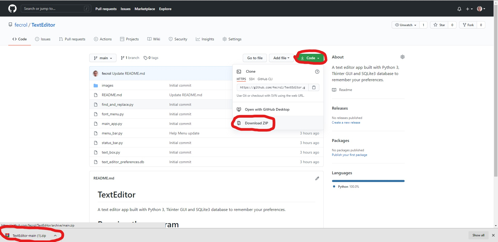

# TextEditor
A text editor app built with Python 3, Tkinter GUI and SQLite3 database to remember your preferences.

# Running the program
To run the program simply download all the files from this repository:

Extract the files:

Run the main_app.py file from the command line:

